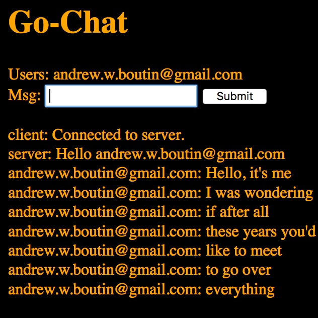

# Go Chat

A chat app written in Go that allows you to chat with other users. Log in with Google to allow the app to know who you are. See what other users are logged on, send messages, and receive messages. This project was primarily for learning Go and brushing up on things such as Redis and Docker.



## Dependencies

- [Docker](https://www.docker.com/)
- [Docker-Compose](https://docs.docker.com/compose/)

## Run

```bash
docker-compose up -d
```

Go chat on `localhost:8080`.

## Redis Store

This utilizes [Redis](https://redis.io/) as a store for connection and user info.

## Gin Session Management and Middleware

This uses [Gin](https://github.com/gin-gonic/gin) and [Gin Sessions](https://github.com/gin-contrib/sessions) for middleware and session management
which is tied into the Redis store.

## Google Integration

This uses [Google OAuth APIs](https://developers.google.com/identity/protocols/OAuth2) to allow a user to login through Google
so that go-chat can access their basic userinfo.

You will have to create a Google application through the [Google Developer Console](https://console.developers.google.com). You'll have to create a Client ID and Client Secret for your application once it's created.

You will need to create a `creds.json` file that has the properties `cid` and `csecret`. These should contain the values for your Client ID and Client Secret for your Google application. This will allow go-chat to use the Google APIs to get user data.

## Glide Dependency Management

We use [Glide](https://github.com/Masterminds/glide) to handle dependency management. The `glide.yaml` defines the dependencies. Compose builds our `dockerfile` which uses a Go base image and then installs `Glide` in it. When the container starts up it calls `glide install` to install all of the dependencies before starting the chat app.

## References

- [Go Chat App](https://scotch.io/bar-talk/build-a-realtime-chat-server-with-go-and-websockets) for Gorilla WebSocket info.
- [Ramblings of a Build Engineer](https://skarlso.github.io/2016/06/12/google-signin-with-go/) was used as a guide for this.

---

Check out my [personal site](https://andrewboutin.com)!
