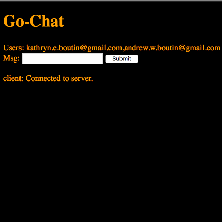

# Go Chat

A chat app written in Go with Google authentication. Chat with other users. This project was primarily for learning Go and brushing up on things such as Redis and Docker.

## Run

Pre-requisites: Install `docker`, and follow *One Time Set Up* below.

    make

`Go` chat on `localhost:8080`.

## One Time Set Up

Create a Google application in [Google Developer Console](https://console.developers.google.com). Then, create a Client ID and Client Secret.

Create `creds.json` with properties `cid` and `csecret`. These should contain your Client ID and Client Secret values. This enables Google authentication.

## Technology

- Uses [Redis](https://redis.io/) as a store for connection and user info.
- [Gin](https://github.com/gin-gonic/gin) and [Gin Sessions](https://github.com/gin-contrib/sessions) are used for middleware and session management which is tied into the Redis store.
- [Google OAuth API](https://developers.google.com/identity/protocols/OAuth2) integrations allow a user to login through Google so that go-chat can access their basic userinfo.
- [Glide](https://github.com/Masterminds/glide) is used for dependency management.

## References

- [Go Chat App](https://scotch.io/bar-talk/build-a-realtime-chat-server-with-go-and-websockets) for Gorilla WebSocket info.
- [Ramblings of a Build Engineer](https://skarlso.github.io/2016/06/12/google-signin-with-go/) was used as a guide for this.

---

Check out my [personal site](https://andrewboutin.com)!
